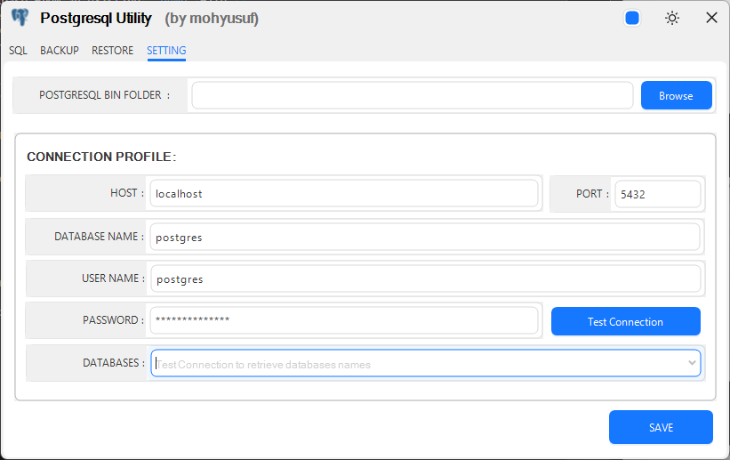

# PostgresqlUtility

A simple Windows Forms application for backing up and restoring PostgreSQL databases.

## Features

- **Sql** Execute SQL commands directly against the database.
- **Backup** your PostgreSQL database to a `.dump` file.  
- **Restore** a database from an existing `.dump` file.  
- **Setting** Manage connection settings (host, port, database, user, password) via a friendly GUI.  
- Configure paths to PostgreSQL CLI tools (`pg_dump`, `pgsql`, `pg_restore`).  
- Built on .NET 9.0-windows with an AntdUI-powered WinForms interface.
- Dark theme support.

## Sql

### Backup

### Restore

### Settings

### Dark Theme

## Prerequisites

- **Operating System**: Windows 10 or later  
- **.NET Runtime**: [.NET 9.0 Runtime](https://dotnet.microsoft.com/en-us/download/dotnet/9.0)  
- **PostgreSQL CLI tools**: Ensure `pg_dump`, `pg_restore` and `psql` are installed and on your system `PATH`.
